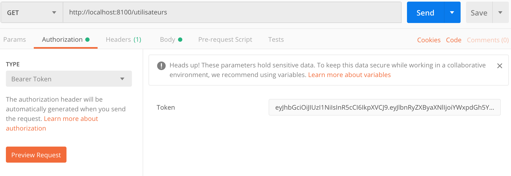

# Version

- **1.0.0-SNAPSHOT** : initialisation du projet

# Objectif

Serveur de resources permettant de gérer les utilisateurs de l'application bancaires.
\
Utilise les verbes CRUD pour la gestion des utilisateurs.

# Technique

Nécéssite une connection oauth2 et d'un jeton JWT pour fonctionner :
https://github.com/langston8182/bank-oauth2-authorization-server
Il faut avant tout démarrer le serveur d'autorisation.

Port d'écoute : 8100

**Postman** :
Se loguer pour récupérer le token JWT

# Docker

Utiliser docker-compose pour lancer le serveur.
`docker-compose up`

# Kubernetes
L'ensemble des configurations k8s se trouvent dans le projet Gihub\
https://github.com/langston8182/kubernetes-bank

Pour lancer le service
`kubectl create -f utilisateur-service.yaml`

Pour lancer le deploiement
`kubectl create -f utilisateur-deployment.yaml`

# Maven

Pour compiler le projet et créer l'image docker exécuter :
\
`mvn package`

Pour push l'image sur dockerHub, exécuter:
\
`mvn dockerfile:push`

# Configuration

Dans le fichier application.yml modifier les adresses Ip suivant si le serveur tourne en local ou dans un container.

Ip du serveur autorisation dans un container : 172.21.0.1

Ip du servuer autorisation dans k8s : authorization-service

# Contributeur

Cyril Marchive (cyril.marchive@gmail.com)
