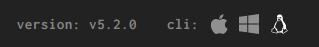
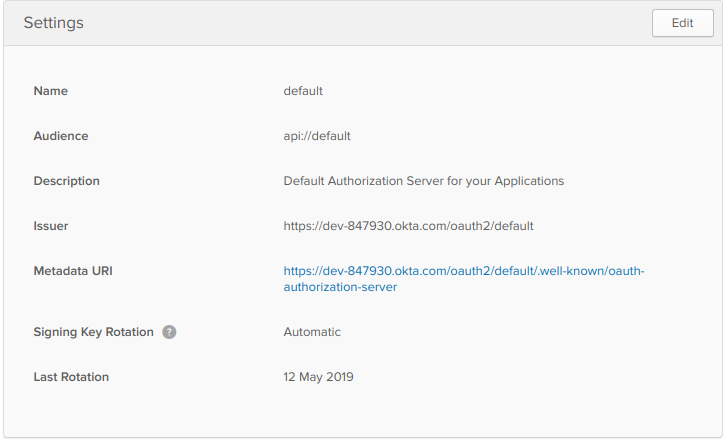
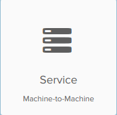
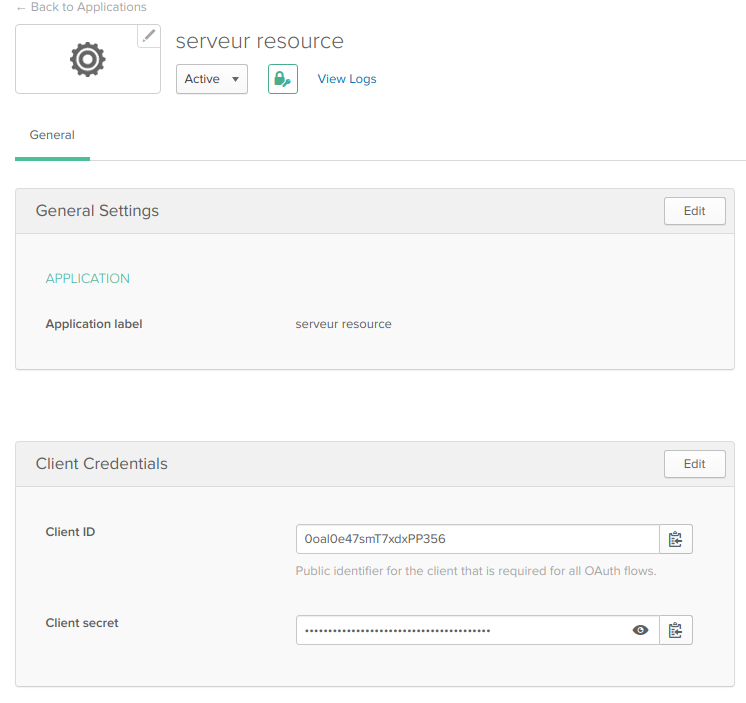
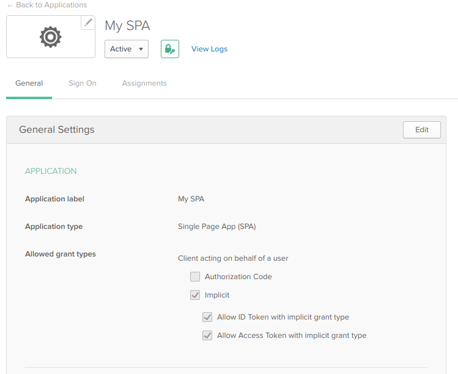
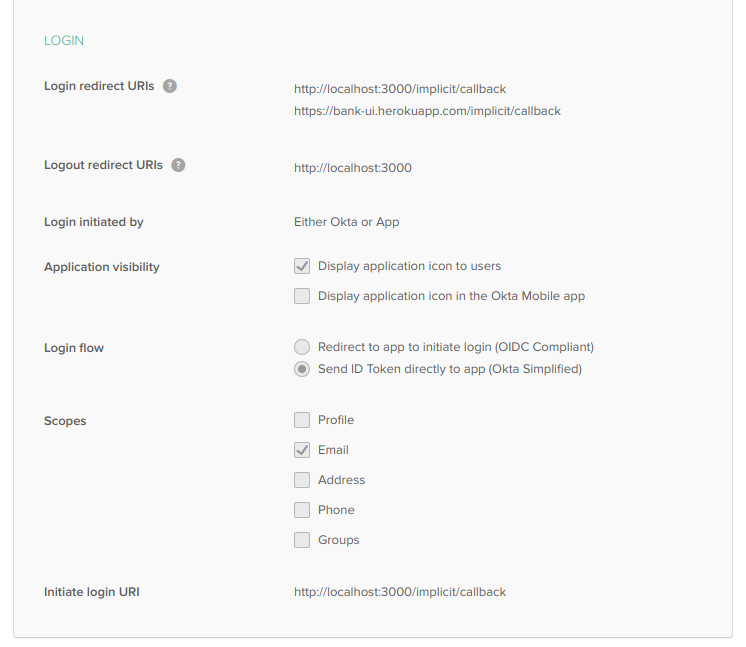
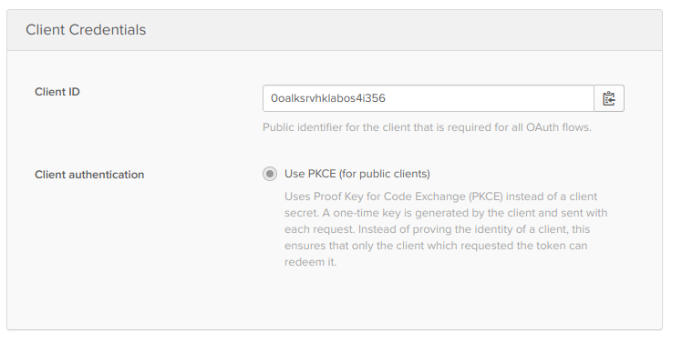
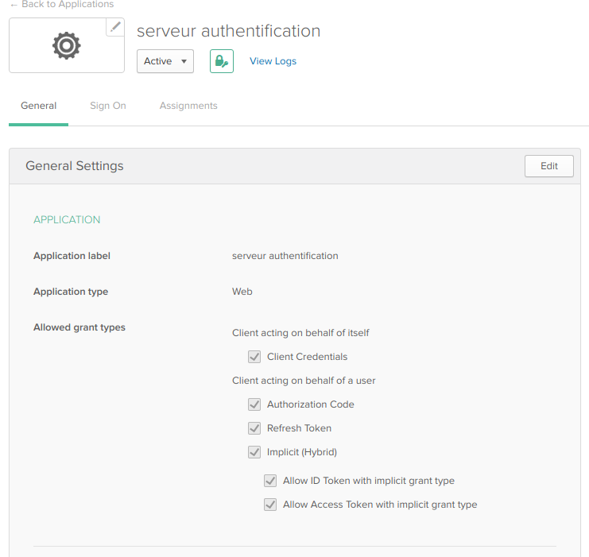
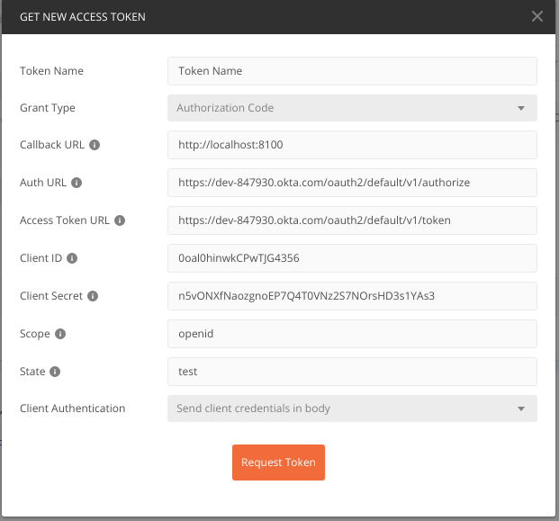
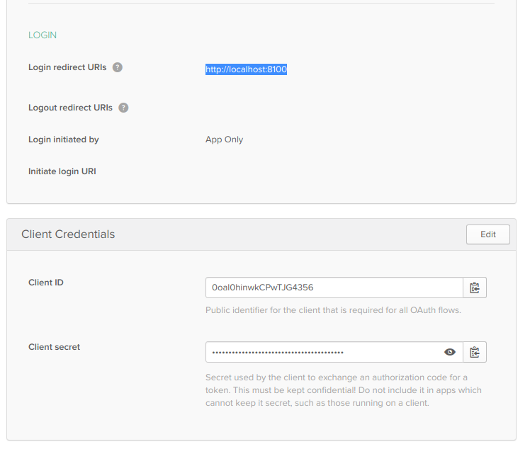

# Version

- **1.1.2-SNAPSHOT** :
- **1.1.1** :
    - Correction d'un fix lors de la generation du jar avec maven
- **1.1.0** :
    - Utilisation de l'Idass Okta pour l'authentification et l'autorisation,
    - Respect du niveau 2 du modèle de maturité (Verbes Delete et Put)
    - Respect du niveau 3 du modèle de maturité (Hateoas)
    - Intégration de swagger et du générateur de code (Api et modèle)
- **1.0.0** : initialisation du projet

# Objectif
Serveur de resources RestFull permettant de gérer les utilisateurs de l'application bancaires.
Utilise les verbes **CRUD** pour la gestion des utilisateurs.

# Technique
Nécéssite une connection oauth2 et d'un jeton JWT pour fonctionner :

https://github.com/langston8182/bank-oauth2-authorization-server

Il faut avant tout démarrer le serveur d'autorisation.

>Port d'écoute : 8100

# Hateoas
Respecte toutes les couches du modèle de maturité de Richardson et notamment le niveau 3 concernant le contrôle Hypermedia.

# Swagger
Utilisation du modèle de spécification Swagger pour documenter l'Api.

http://localhost:8100/swagger-ui.html

Toutes les ressources et Api sont générées grâce au plugin maven **swagger-codegen-maven-plugin**

La documentation swagger se trouve dans le projet [github ressource]. Dans ce projet lancer la commande suivante pour générer les ressources.

```sh
$ mvn clean install
```

# Postman :
Se loguer pour récupérer le token JWT


# Docker
Utiliser docker-compose pour lancer le serveur.
```sh
$ docker-compose up
```

# Kubernetes
L'ensemble des configurations k8s se trouvent dans le projet Gihub
https://github.com/langston8182/kubernetes-bank

Pour lancer le service
```sh
$ kubectl create -f utilisateur-service.yaml
```

Pour lancer le deploiement
```sh
$ kubectl create -f utilisateur-deployment.yaml
```

# Maven
- Pour compiler le projet :
```sh
$ mvn clean install
```

- Pour construire l'image Docker :
```sh
$ mvn dockerfile:build
```

- Pour push l'image sur dockerHub, exécuter:
```sh
$ mvn dockerfile:push
```

# Concourse
Concourse est un outil pour faire du développement continue. A l'instar de Jenkins, 
il s'agit d'un pipeline as code. Fly est un interpreteur de commandes pour manipuler les pipelines concourse.

### Installation :
https://github.com/concourse/concourse-docker

https://concoursetutorial.com/

Pour se connecter à l'application les identifiants par defaut sont test / test

#### Commandes fly:
Pour installer fly cliquer pour telecharger le binaire suivant l'os utilise



Puis lancer les commandes suivantes:
```sh
$ chmod 0755 fly
$ sudo mv fly /usr/bin/

```

- Créer un token de connexion
```sh
$ fly login --concourse-url http://127.0.0.1:8080 -u test -p test
```
- Lister les targets
```sh
$ fly targets
```

Pour chaque commande qui va suivre il faut suivre fly du target (fly -t tutorial).

- Créer un alias fly
```sh
$ alias fly="fly -t tutorial"
```
- Créer un pipeline a partir d'un fichier de configuration\
```sh
$ fly sp -p service-utilisateur -c ci/pipeline.yml -l credentials.yml
```

Ne pas oublier de mettre le pipeline en eveil a partir de l'interface web.

#### Utilisation :
Pour le projet, un triger est lance dès que un commit est fait sur la branche master.
Le build du projet a lieu (mvn clean install), puis a l'issue de ce build, une image docker du jar est crée.
Cette image est ensuite déployé sur le registry docker.

# Configuration
Dans le fichier application.yml modifier les adresses Ip suivant si le serveur tourne en local ou dans un container.
Ip du serveur autorisation dans un container : **172.21.0.1**
Ip du servuer autorisation dans k8s : **authorization-service**

# Okta
Okta est une solution **IDass** (Identity as a Service) qui permet de gerer les authentifications et les autorisations en utilisant OpenId Connect.

#### Serveur autorisation
Il faut commencer par creer un serveur d'autorisation


#### Applications
Creer une application pour le serveur de resource en choisissant **Service Machine to machine**

Le serveur de resources est en charge de verifier que les token JWT sont corrects.





Le serveur de resources n'est pas capable de fournir un token JWT. Pour cela, un serveur d'authentification est necessaire.

Creer une application pour le serveur d'authentification en choisissant **Single Page Application** afin que le client s'authentifie pour une application React (Grant type implicit)






#### Serveur de resource
Ajouter les configurations okta dans le fichier **application.yml**

Recuperer le *clientId* et *clientSecret* du serveur de resources cree precedement.
```
okta:
  oauth2:
    issuer: https://dev-847930.okta.com/oauth2/default
    clientId: 0oalbqv5tDtNvYWwY356
    clientSecret: kKdzYKFoS9GBhiY7G3ryS2XCzHCuUs8TJX6HACOr
```

#### Postman
Pour recuperer le token JWT, il faut creer une applicatin Okta de type Web (Grant type AuthorizationCode)



Pour recuperer un nouveau token Postman, aller dans l'onclet Authorization choisir le type Oatuh2 puis cliquer sur **Get new access token**





#### Maven
Ajouter dans le *pom.xml*
```xml
<dependency>
	<groupId>org.springframework.boot</groupId>
	<artifactId>spring-boot-starter-security</artifactId>
</dependency>
<dependency>
	<groupId>org.springframework.cloud</groupId>
	<artifactId>spring-cloud-starter-oauth2</artifactId>
</dependency>
<dependency>
    <groupId>org.springframework.security.oauth.boot</groupId>
    <artifactId>spring-security-oauth2-autoconfigure</artifactId>
    <version>2.1.4.RELEASE</version>
</dependency>
<dependency>
	<groupId>org.springframework.security</groupId>
	<artifactId>spring-security-oauth2-resource-server</artifactId>
	<version>5.1.5.RELEASE</version>
</dependency>
<dependency>
	<groupId>com.okta.spring</groupId>
	<artifactId>okta-spring-boot-starter</artifactId>
	<version>0.6.1</version>
</dependency>
```

# Nexus

#### Lancement

Au premier demarrage de Nexus il faut créer un volume docker
```sh
$ docker volume create --name nexus-data
```

Pour démarrer Nexus utiliser l'image docker
```sh
$ docker pull sonatype/nexus3
$ docker run -d -p 8081:8081 --name nexus -v nexus-data:/nexus-data sonatype/nexus3
```
Credentials :
> admin\
> admin123

#### Configuration
Ajuster le fichier *settings.xml* et ajouter les lignes suivantes :

```xml
<servers>
    <server>
      <id>nexus-snapshots</id>
      <username>admin</username>
      <password>admin123</password>
    </server>
    <server>
      <id>nexus-releases</id>
      <username>admin</username>
      <password>admin123</password>
    </server>
</servers>

<mirrors>
    <mirror>
      <id>central</id>
      <name>central</name>
      <url>http://localhost:8081/repository/maven-public/</url>
      <mirrorOf>*</mirrorOf>
    </mirror>
</mirrors>
```
Modifier ensuite le fichier *pom.ml*
```xml
<properties>
    <java.version>11</java.version>
</properties>

<repositories>
    <repository>
        <id>maven-group</id>
        <url>http://localhost:8081/repository/maven-public/</url>
    </repository>
</repositories>
```  

# Création d'un tag

#### Préparation du tag

- Modifier le fichier **README** et modifier le tag
- Modifier le fichier **pom.xml** et modifier le tag
- Modifier le fichier **pipeline.yml** et modifier le tag
- Modifier le fichier **docker-compose.yml** et modifier le tag
- Effectuer tous les test d'intégration postman.
- Effectuer les tests docker\
Modifier l'adresse ip de la Bdd dans le fichier *application.yml* et mettre celle de docker
> 172.17.0.1 (docker inspect <id container>)
```sh
$ mvn clean install -DskipTests
$ mvn dockerfile:build
$ docker-compose up -d
```
Effectuer les tests d'integration en modifiant l'adresse ip sur postman (localhost => 172.17.0.1)
- Lancer la commande
```sh
$ mvn clean install
```
Et vérifier qu'il n'y a aucune erreur.

- Aller dans le répertoire `target` et vérifier que le jar est présent avec la bonne version.
- Pusher sur master les modifications du readme et du pom. avec comme message :
> Release 1.0.0

#### Création du tag

```sh
$ git tag 1.0.0
$ git push origin --tags
```

- Vérifier dans github que la release est bien créée.
- Editer la release pour ajouter un titre et une description.
- Vérifier le commit relatif au tag. Ce commit ne doit contenir que le changement de version.

#### Dockerhub

- Lancer les commandes maven suivantes :
```sh
$ mvn dockerfile:build
$ mvn dockerfile:push
```
- Vérifier dans dockerhub que le tag a bien été crée.

#### Nexus

- Lancer la commande maven suivante :
```sh
$ mvn deploy
```

#### Préparation à la prochaine release

- Modifier le fichier **README.md** pour ajouter le prochain *SNAPSHOT*
- Modifier le fichier **pom.xml** pour modifier le tag avec prochain *SNAPSHOT*
- Modifier le fichier **pipeline.yml** et modifier le tag avec le prochain *SNAPSHOT*
- Modifier le fichier **docker-compose.yml** et modifier le tag avec le prochain *SNAPSHOT*
- pusher les modification sur github.
- Lancer les commandes maven suivantes :
```sh
$ mvn dockerfile:build
$ mvn dockerfile:push
```


# Contributeur
Cyril Marchive (cyril.marchive@gmail.com)

[github ressource]: https://github.com/langston8182/service-utilisateur-ressource
